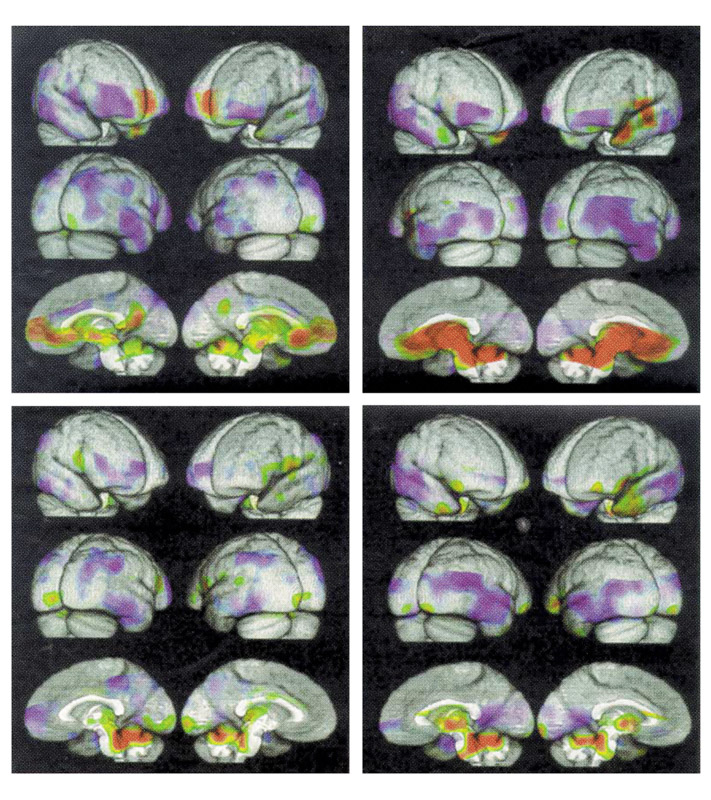
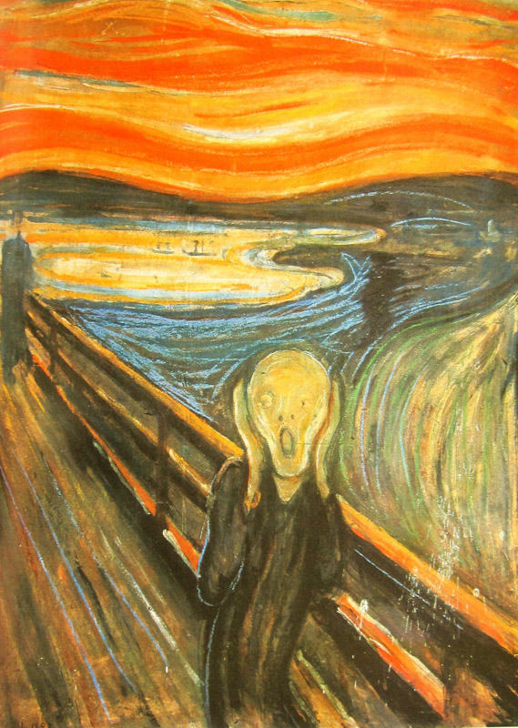
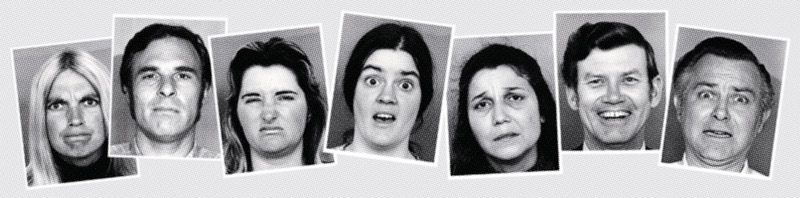
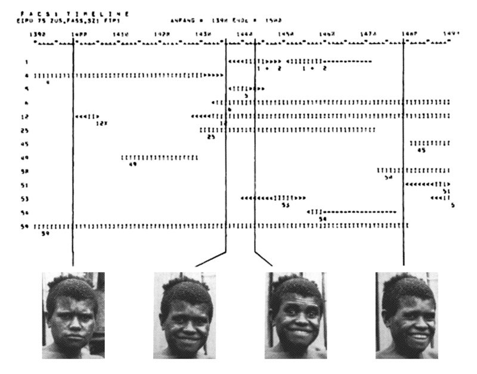
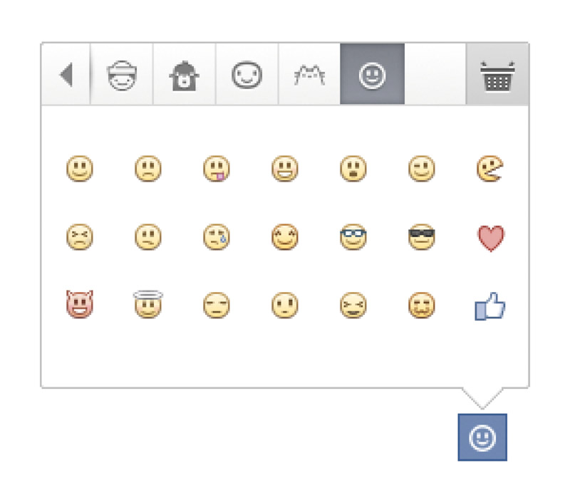

# Quelques invisibles et leurs visualisations

**
On ne manque pas d’invisibles à visualiser. Le temps a ses cônes de lumière et ses frises chronologiques, la gravitation a ses vecteurs fléchés et les courbes qu’elle donne à l’espace-temps. Mais comment représenter le langage, les saveurs, les odeurs, les émotions, le mouvement ? Résumé des usages établis.
**

## Visualiser le langage

Il n’y aura pas tant sur le langage et l’écriture dans ces pages. Si c’est un sujet très intéressant qui coïncide avec le thème général — l’écriture est le principal système de visualisation du langage — c’est aussi un domaine immense qui dépasse largement le cadre de cette publication. C’était difficile de ne pas le mentionner non plus. Plutôt que de détailler l’invention de l’écriture et toutes ses formes, quelques citations à propos de l’écriture comme représentation graphique du langage :

> « Langue et écriture sont deux systèmes de signes distincts ; l’unique raison d’être du second est de représenter le premier. »

— Ferdinand de Saussure

> « L’écriture n’est pas la langue, mais un simple moyen d’enregistrer la langue par des marques visibles. »

— Leonard Bloomfield

> « L’écriture n’est pas un écho graphique de la parole, mais un système de représentation des idées qui possède sa propre autonomie. »

— Roy Harris (paraphrasé)

> « L’écriture engendre un surplus de sens inépuisable et contribue à la modélisation du réel. »

— Jean-Jacques Glassner

La modélisation du réel, c’est une notion qui comprend la visualisation de l’invisible. Le langage oral est précisément un de ces phénomènes invisibles qui ont été adaptés sous forme de langage graphique pour plusieurs raisons (transmission à travers l’espace et transmission à travers le temps, notamment). Si toutes ces citations ne sont pas du même avis sur la nature et la fonction de l’écriture, il serait intéressant de les considérer dans d’autres contextes, voir si elles peuvent éventuellement s’appliquer à d’autres invisibles.

Est-ce la notation musicale est plus qu’un « écho graphique » de la musique, ou bien n’est-ce qu’un « simple moyen de l’enregistrer par des marques visibles » ? C’est une piste à explorer.

*Ci-dessus : Ces paragraphes sont écrits avec l’alphabet latin, un des systèmes
de visualisation du langage les plus répandus.*

## Visualiser les saveurs et les odeurs

Le goût et l’odorat sont deux sens incontestablement liés, d’abord par leur proximité — le fait que la perception globale des saveurs est influencée par l’olfaction rétro-nasale qui a lieu en simultané, puis par leur rencontre dans le cortex pré-frontal, quartier cervical qui s’applique à interpréter les deux.

La question est, on le fait bien pour l’ouïe en visualisant le son : peut-on (ou a-t’on) visualiser les saveurs et les odeurs ?
Au a-t’on, la réponse semble globalement non. Les synesthésies goût–vue et odorat–vue semblent assez rares, et si il y a bien des cartographies répartissant sur la langue sucré, salé, amer et acide comme on en voit à l’école maternelle, elles sont toutes issues de la traduction erronée d’une thèse allemande de 1901 et passent à côté de la cinquième saveur élémentaire perçue par les humains, l’umami.

Pourtant, saveurs et odeurs possèdent un riche vocabulaire les décrivant : ne pourrait-on pas l’adapter et développer un système pour les visualiser, si ce n’est rationnellement, au moins perceptivement ? Peut-être.

En attendant, le seul moyen de visualiser une odeur est de visualiser ce qui en est la source : la molécule odorante. Pour ce qui est de visualiser les molécules (pas invisibles en soi, mais picoscopiques), les scientifiques savent faire. **— Image B**

S’il y a des gens qui seraient intéressés pour visualiser les saveurs et les odeurs, ce sont ceux qui les synthétisent et voudraient les enregistrer en tant que marques commerciales. L’European Trademark Directive, par exemple, n’accepte que les signes qui peuvent être représentés graphiquement en utilisant des images, des lignes et des glyphes, de manière claire, précise, auto-suffisante, intelligible, durable et objective. Plusieurs enregistrements de saveurs et d’odeurs ont été tentés, utilisant des descriptions comme « l’odeur des fraises mûres » accompagnés de schémas moléculaires, mais peu semblent avoir été acceptés par les bureaux d’enregistrement.

**IMAGE B**  
*Le citronellol, molécule organique à l’origine de l’odeur de citronnelle et en partie de celles de la rose, de la noix de muscade et de certains géraniums, visualisé sous forme de formule topologique, un des systèmes de représentation des molécules chimiques.*

## Visualiser les émotions

Si les deux sens précédents finissent par être moulinés dans le cerveau, qu’en est-il des phénomènes qui y sont créés directement ? Les idées, ou bien les émotions ?

D’un point scientifique et médical, le neurologue Antonio Damasio a démontré dans ses ouvrages comment des émotions comme la tristesse, la colère la joie ou la peur peuvent être associés à des motifs particuliers provoqués dans des régions spécifiques du cerveau. Or, on dispose depuis quelques temps de techniques d’imagerie cérébrale qui permettent de visualiser ce qu’il s’y passe. L’imagerie par résonance magnétique (IRM) ou la tomographie par émission de positons (TEP) sont des exemples de dispositifs qui permettent de générer des visualisations des parties cervicales en activité. On peut donc obtenir des visualisations correspondant à différentes émotions.

  
*IRM et TEP combinés, visualisant l’activité cérébrale lors de la joie, la dépression, l’anxiété et l’irritation.*

Dans l’art, la représentation des émotions est chose courante. Si ce n’est pas les émotions ressenties par les personnages d’un scène dépeinte, un œuvre peut se faire allégorie même d’une émotion.

  
*Le Cri, de Edvard Munch. L’artiste se décrit « tremblant d’anxiété » lorsque l’idée lui vint.*

Mais hors des visualisations artificielles, on est aussi équipé d’un dispositif permettant de retranscrire instinctivement et visuellement, quoi que partiellement, nos émotions : le visage. L’idée que les expressions faciales soient une manifestation universelle des émotions ressenties vient de Charles Darwin, mais a été largement diffusé par les travaux réalisés par Paul Ekman au vingtième siècle. Ses recherches ravivent le domaine de la science des émotions et va jusqu’à intéresser les enquêteurs des services secrets qui trouvent dans l’analyse des micro-expressions une méthode pour passer à travers les mensonges dans les interrogatoires.

  
*Les expressions type identifiées par Ekman pour ses recherches : colère, mépris, dégoût, surprise, tristesse, joie et peur.*

Même si l’universalité de ses travaux sont désormais critiquée, notamment par la professeure de psychologie Lisa Barrett, qui décrit comme les recherches sur lesquelles se fondaient les résultats d’Ekman étaient biaisées, il reste qu’émotions et expressions semblent liées.

Mais comment les représenter ? Il existe un système de notation, facial action coding system, non-graphique, pour coder les expressions du visage, dévelloppé par Ekman et Wallace Friesen dès 1971 d’après les travaux de l’anatomiste Carl-Herman Hjortsjö. FACS permet de décrire les contractions et décontractions des muscles du visage en utilisant des lettres et des chiffres. Ainsi on peut coder un visage stéréotype de la surprise par *1+2+5B+26* ou un visage exprimant le mépris par *R12A+R14A*. Si ce n’est pas une notation visuelle, elle le devient lorsqu’on la prend en compte à travers le temps.

  
*Une salutation par un haussement des sourcils accompagné d’un sourire et d’un hochement de tête, visualisée dans le temps avec la notation FACS.*

Une note rapide sur les émoticônes, représentations typographiques des expressions faciales, et donc des émotions. Si l’idée de dessiner des visages avec des caractères typographiques apparaît dès le dix-neuvième siècle, c’est leur réinvention par Scott Fahlman en 1982 qui semble être le mème à l’origine de leur utilisation massive aujourd’hui :

>« Je propose cette séquence de caractères pour marquer les messages à caractère humoristiques : :-) »

écrivit-il sur le forum de l’université de Carnegie Mellon. **— Image G**

  
*Les émoticônes illustrées d’aujourd’hui, visualisations picturales de visualisations typographiques de visualisations faciales des émotions.*

## Visualiser le mouvement

En assumant qu’il est éclairé et pas plus rapide que l’œil, le mouvement n’est pas invisible en soi. Il s’agit pourtant d’un phénomène éphémère, qui — d’une certaine manière — est invisible une fois qu’il est passé, car il n’existe plus. C’est en tout cas à cause de sa fugacité qu’on a cherché à le représenter, en particulier dans la science et dans l’art. **— Image H**

Un enregistrement cinématographique ou vidéo est bien entendu une visualisation durable du mouvement, mais il existe également des représentations et des systèmes de notations plus graphiques. **— Image M**

En éthologie par exemple, le comportement des animaux — et on y inclut celui des humains — se traduit souvent par le mouvement. Déplacements au sein d’un groupe, migrations, compétences manuelles, rituels, techniques de constructions, interactions quotidiennes et danses variées sont autant d’activités qui peuvent être retranscrites sous forme graphique pour les comparer, les archiver ou les étudier par la suite. **— Images I, L**

La danse est également dans sa pratique artistique un domaine où la transcription sur papier des mouvements est  souhaitée. De nombreux systèmes de notations graphiques ont été mis au point par des chorégraphes pour les représenter. **— Images J, K**

Les principes de visualisations du mouvement sont multiples et prennent en compte des variables et une forme différentes selon leur finalité. Il y a des systèmes sur mesure pour chaque usage. **— Image N**

**IMAGE H**  
*Dans *Nu descendant un escalier n°2*, Marcel Duchamp met en image le mouvement en dépeignant par superposition ses étapes successives, à la manière d’une chronophotographie.*

**IMAGE I**  
*La représentation du mouvement est beaucoup utilisée en éthologie. Sous sa forme la plus simple, un simple tracé de trajectoires, sans facteur temps, peut permettre de dégager les motifs du comportement animal. Ici, c’était prévisible, la visualisation des déplacements d’une souris dans une boîte montre à quel point elle s’intéresse à sa mangeoire.*

**IMAGE J**  
*Notation graphique de *La Cachucha*, par Friedrich Albert Zorn. C’est une notation partiellement figurative, partiellement symbolique, et synchronisée avec une notation musicale.*
 
**IMAGE K**  
*La visualisation de la danse peut être très simple, comme dans ce système de symboles pour noter les pas du tango.*

**IMAGE L**  
*Pour prendre en compte plus de variables, elle peut aussi se faire plus complexe. Ici, une étude éthologique sur la danse de séduction chez les Himbas représente toutes leurs actions et interactions.*

**IMAGE M**  
*Le système cinétographique Labanotation, développé depuis le travail de Rudolf Laban, permet de décrire tout type de mouvement humain. Les colonnes reprennent la symétrie du corps, le temps s’écoulant de bas en haut. En fonction de la forme des signes, de leur remplissage et de leur position, on peut lire des mouvements précis et les reproduire.*

**IMAGE N**  
*Ce système de notation permet de retranscrire le langage des signes. Il s’agit de SignWriting, dévelloppé en 1974 par la danseuse Valerie Sutton après son travail sur DanceWriting. Chaque position des mains, mouvement des doigts et expression faciale y est représenté par un symbole unique.*

##  Visualiser le son et la musique

Il y a pas mal de choses à dire sur ces deux-là. Peut-être méritent-t’ils un chapitre entier ? Oui, allez.