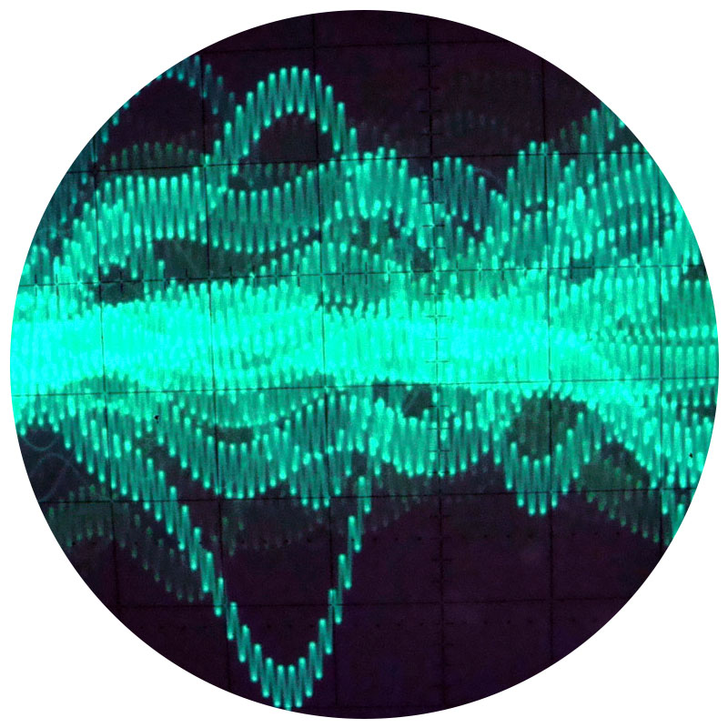

# Visualiser le son et la musique

**
Il est temps de se concentrer sur un seul invisible, le son et la musique. Nous allons nous en approcher davantage que les précédents, pas tant pour lui donner une importance particulière que pour s’en servir comme exemple à la notion plus grande qu’est la visualisation de l’invisible.
**

## Visualiser le son

Le son est propagé par le déplacement de la pression d’un fluide, tel l’air, causé par une vibration avant d’être finalement répercuté sur les mécanismes logés dans nos oreilles.

  
**ꜛ**
*Tout comme le son, le vent se propage dans l’air. Pourtant, personne ne semble représenter le son de cette façon. Mais personne n’a non plus essayé de reproduire le vent depuis une carte du vent. Assurément, le type de visualisation est choisi en fonction de l’objectif intentionné.*

### Audiogrammes

  
**ꜛ**
*Un audiogramme, un graphe en deux dimensions représentant l’amplitude du son selon le temps.*

Pour l’analyser et le représenter, on lui appliquer le modèle des ondes mécaniques progressives, qui permet de résumer ces vibrations en fréquences et amplitudes, et peut être représenté grâce à une courbe en deux dimensions.

Si une onde mécanique classique se visualise d’une simple sinusoïdale, le mathématicien Joseph Fourier comprend en 1822 que la complexité du son peut être décrite comme une série de sinusoïdales superposées.

  
**ꜛ**
*Joseph Fourier décrit la manière dont un son complexe peut être décomposé en un ensemble d’ondes plus simples.*

Les ondes sonores peuvent être converties en tension électrique — par l’intermédiaire d’un microphone par exemple — en vue d’être amplifiées, enregistrées ou visualisées (notamment grâce à un oscilloscope).

  
**ꜛ**
*Une onde sonore visualisée sur un oscilloscope.*

L’image d’une onde sonore, un audiogramme, est une de ces visualisations qui permet la reproduction du phénomène original, ici le son enregistré — avec un taux d’erreur très faible si la visualisation est précise. Par exemple, le disque microsillon, inventé en 1946, est une sculpture hélicoïdale microscopique d’une onde sonore prête à être reproduite.

  
**ꜛ**
*Vue au microscope d’un disque microsillon.*

Au cinéma, une bande-son optique, telle qu’inventée par Lee De Forest dès 1919, est une visualisation du son imprimée près des perforations, courant en parallèle des images du film.

  
**ꜛ**
*Bordure d’un film 35mm. On y voit à droite un audiogramme stéréophonique (à deux pistes) qui est lu optiquement par le circuit sonore du projecteur. Les nuages de pixels sur la gauche et au milieu sont les bandes-son numériques.*

De nombreux artistes et ingénieurs ont expérimentés avec ce principe d’audiogrammes lus grâce à un dispositif optique. Arseny Avraamov produit en 1930 des bandes-son peintes à la main pour le cinéma ; Evgeny Scholpo développe la même année une machine nommée variophone ; En 1939, le livre *Theory and Practice of Graphic Sound* est publié ; En 1977, Iannis Xenakis conçoit au Centre d’Études de Mathématique et Automatique Musicales l’*UPIC*, un synthétiseur fondé sur le dessin des ondes sonores — cette fois-ci de manière numérique plutôt qu’optique. 

  
**ꜛ**
*Une enveloppe sonore dessinée à la main pour le synthétiseur UPIC.*

Beaucoup tentent de dessiner des formes géométriques voire figuratives afin d’écouter le son qu’elles produisent. Plusieurs projets font courir les audiogrammes de manière circulaire sur des disques plutôt que des bobines : *Welte Light-Tone* de Edwin Emil Welte en 1936, l’*ANS Synthesizer* de Evgeny Murzin en 1958, l’*Optigan* en 1971, *ToneWheels* en 2007, *The Evil Eye* en 2012.

  
**ꜛ**
The Evil Eye*, un des projets les plus récents de disque sonore optique.*

Comme le son possède cette possibilité d’être représenté graphiquement de manière précise, il peut être déposé dans les bureaux d’enregistrement des marques de commerce, qui n’acceptent traditionnellement que les textes et les dessins et schémas. Il est intéressant de noter par exemple que le rugissement du lion ouvrant les films de la Metro-Goldwyn-Mayer fût ainsi déposé comme marque sonore, sous la forme d’un spectrogramme.

### Spectrogrammes

Parlons-en, des spectrogrammes. Le spectrogramme, ou sonagramme, est une autre méthode de visualisation du son. C’est une visualisation de l’intensité du son par fréquence en fonction du temps, là où les audiogrammes présentés jusque ici montraient l’amplitude du son en fonction du temps. **— Image 9**

  
**ꜛ**
*Un spectrogramme. En l’occurrence, il s’agit de celui correspondant à l’audiogramme présenté en début de section précédente.*

La fréquence sonore, nous y reviendrons en passant à la musique, est déterminante de la hauteur du son. Le spectrogramme possède donc l’avantage de visualiser la répartition entre les aigus et les graves de l’intensité d’un son.

Comme un axe est utilisé pour le temps et un second pour la fréquence, l’intensité doit être visualisée grâce à un troisième axe dans un spectrogramme en trois dimensions, ou avec une variation de couleur ou d’opacité si il reste en deux dimensions.

  
**ꜛ**
*Le spectrogramme tridimensionnel d’un morceau de musique.*

  
**ꜛ**
*Le spectrogramme en couleurs du chant d’un merle bleu.*

Les spectrogrammes sont très utilisés pour reconnaître, analyser et comparer les sons, leur apparence s’apparentant à une sorte d’empreinte du son enregistré. Ils servent notamment pour les recherches en zoologie (champs des oiseaux, cris d’animaux), la phonétique et la reconnaissance vocale.

  
**ꜛ**
*La prononciation des mots “ball”, “bar”, “bough” et “buy” visualisée sous forme de spectrogramme.*  

  
**ꜛ**
*Les mêmes mots représentés dans l’alphabet phonétique international. Si on sort des spectrogrammes, la plupart des visualisations des prononciations sont des systèmes d’alphabets comme celui-ci, recyclant des lettres et des symboles pour une utilisation phonétique.*

  
**ꜛ**
*Un guide visuel pour reconnaître certaines syllabes dans les spectrogrammes.*

  
**ꜛ**
*L’autre chose visuelle que font les phonéticiens, c’est placer les sons dans des espaces en deux dimensions. Ici, le triangle vocalique,  une répartition des voyelles dans le plan mise au point en 1781 par le médecin Christoph Friedrich Hellwag.*

C’est donc une forme de visualisation automatisée qui est surtout destinée à la lecture humaine. Il est cependant possible de reproduire informatiquement un son depuis un spectrogramme et — anecdotiquement — de dessiner un spectrogramme artificiellement avant de le convertir en ondes sonores. Cette technique est utilisée par plusieurs artistes musicaux pour dissimuler par stéganographie des images et des photographies au sein de leur pistes sonores.

  
**ꜛ**
*Le musicien Venetian Snares a caché des photos de ses chats dans son album *Songs About My Cats* à l’aide d’un spectrogramme artificiel converti en piste audio.*

## Du son à la musique

  
**ꜛ**
*Le logiciel Celemony Melodyne Editor décompose note par note les enregistrements sonores d’une pièce musicale, générant ainsi une composition d’audiogrammes répartis sur une échelle chromatique. C’est un exemple de modélisation à mi-chemin entre la visualisation du son et la visualisation de la musique. Les notes peuvent être déplacées en hauteur, et régénérées en sons, ainsi ajustés.*

Avant de passer à la visualisation de la musique, survolons un instant ce qui forme la musique d’un point de vue sonore. La musique peut être réduite à quatre composantes : hauteur, durée, intensité et timbre.

La hauteur est définie par la fréquence de l’onde sonore. Plus le nombre d’oscillations sur un temps donné est élevé, plus le son est aigu, plus le nombre d’oscillations est faible, plus le son est grave.

  
**ꜛ**
*Un son aigu formé par une fréquence élevée, un son grave formé par une fréquence faible.*  

| **Note** | **Hertz** |
| -- | -- |
| Do | 261,63 |
| Do ♯ | 277,18 |
| Ré | 293,66 |
| Ré ♯ | 311,13 |
| Mi | 329,63 |
| Fa | 349,23 |
| Fa ♯ | 369,99 |
| Sol | 392,00 |
| Sol ♯ | 415,30 |
| La | 440,00 |
| La ♯ | 466,16 |
| Si | 493,88 |
**ꜛ**
*Les fréquences en hertz définissant chaque note dans la troisième octave.*

En réalité, les hauteurs perçues sont souvent composées de plusieurs fréquences superposées, et peuvent même être extrapolées par l’oreille quand la fréquence fondamentale n’est pas présente.
Certaines de ces fréquences, reconnues grâce à une suite harmonique mathématique et aux vibrations synchronisées qu’elles produisent dans les oreilles, ont été sélectionnées et nommées. Ce sont les notes, en tout cas celles historiquement associées à la musique occidentale.

La durée est simplement la composante temps de la musique, formant le rythme, la longueur des notes et des silences. L’intensité est la puissance des ondes sonores, leur force, leur volume, leur nuance.

Le timbre est plus difficile à rationaliser. Il décrit la sonorité d’un instrument, les caractéristiques sonores qui le différencient des autres, sa voix en quelque sorte. Il possède un ensemble de composantes, comme la brillance, le vibrato ou la texture sonore. C’est ce qui fait qu’un piano et qu’une guitare jouant la même note, avec la même durée et la même intensité, ne produisent pas le même son.

Ça fait quatre variables à visualiser lorsqu’on veut représenter la musique.

## Visualiser la musique

L’une des raisons principale pour laquelle on visualise la musique est en vue de la reproduire. La transmission des morceaux entre musiciens, tant dans le temps que dans l’espace, implique la création de systèmes de notation permettant de représenter les pièces musicales sous une forme reproductible.

### Représentation du timbre

La plupart de ces langages graphiques s’intéresse à la hauteur, à la durée, et — dans une moindre mesure — à l’intensité. Le timbre, intrinsèque à chaque instrument, reste généralement à l’écart de ces visualisations.

C’est une constatation que fait Adriano Abbado dans une thèse qu’il publie en 1988. Il remarque que la notion de timbre est constamment ignorée en musique occidentale, alors que c’est une composante importante dans les musiques d’autres cultures, comme dans les chants des moines tibétains qui se concentrent davantage sur les variations de timbre que sur les changements de hauteurs. Avec l’arrivée des synthétiseurs, cependant, la possibilité de façonner la sonorité d’instruments artificiels a redonné à la notion de timbre son importance.

Il s’intéresse à la classification des timbres par Fred Lerdhal puis travaille enfin sur leur visualisation. C’est le projet *Dynamics*.

  
**ꜛ**
*Le timbre tel que représenté dans le projet *Dynamics*.*

Pour retranscrire les différentes caractéristiques des timbres et leur richesses, il utilise des infographies 3D abstraites. Par exemples, les sons harmoniques sont associés à des formes lisses et les sons inharmoniques à des formes rugueuses. La forme, la couleur et la texture de ces objets tridimensionnels, ainsi que leur position dans l’espace, sont autant de variables qu’Abbado associe pour représenter le timbre.

Les choix sont délibérément subjectifs :
> « Établir une méthode de correspondance rigide peut devenir une procédure mécanique qui limite le processus créatif et se trouve inévitablement répercutée dans l’œuvre finale. Je n’ai donc jamais analysé le spectre sonore avec une précision absolue, mais ai plutôt modélisé des objets se rapprochant au plus d’attributs auditifs perceptibles, applicables à un contexte visuel : rugosité, humidité, température, viscosité, spongiosité, granularité, opacité, et ainsi de suite. »

Nous avons donc affaire à une visualisation qui se situe dans l’interprétation, plutôt que dans la représentation ou la notation.

### Représentation de la hauteur et de la durée

Revenons sur deux autres composantes de la musique, la hauteur et la durée. Toutes deux sont des valeurs à une dimension, la musique réduite à ces deux caractéristiques pouvant ainsi être représentée en deux dimensions. Sur un axe, la hauteur, décrite en fréquences ou en notes ; Sur l’autre, la durée, en secondes ou en temps (pluriel, au sens musical).

C’est de cette façon qu’est stockée la musique sur les bandes papiers perforées d’un orgue de Barbarie, par exemple. Les notes sont réparties en hauteur, actionnant des soufflets différents, et la durée s’étale en longueur, l’étendue réelle d’un temps dépendant de la vitesse à laquelle le musicien tourne la manivelle. Un piano mécanique fonctionne de manière similaire.

  
**ꜛ**
*La bande de papier perforée d’un orgue de Barbarie.*

Les perforations pour les orgues de Barbarie, si elles sont visibles et peuvent être qualifiées de visualisation, ne sont pourtant pas destinées à une lecture humaine.

On retrouve cependant ce principe dans le projet débuté en 1974 par Stephen Malinowski. Frustré de la complexité des partitions traditionnelles, il tente de trouver une méthode pour visualiser des morceaux de musique de manière plus instinctive.

Il représente un concerto de Brandenburg sur une bande de papier quadrillé de six mètres de long. Le principe est en tous points similaire à ceux des orgues de Barbarie, à part que Malinowski utilise également la couleur pour différencier les différents instruments de l’orchestre. **— Image 20**

  
**ꜛ**
*À l’origine de la *MAM*, un concerto de Brandenburg sur une bande de papier.*

En 1981, un ami lui suggère de l’animer, mais le travail d’animation est très fastidieux. Jusqu’en 1985, il met alors au point un programme informatique répliquant le principe de sa bande de papier mais de manière automatisée : c’est la *Music Animation Machine*. **— Image 21**

  
**ꜛ**
*Portion de visualisation par la *Music Animation Machine* d’une pièce musicale.*

Il y travaille encore aujourd’hui, produisant de nombreuses visualisations de morceaux qu’il distribue sous forme vidéo.

### Notation de la musique

Cependant, la visualisation de la musique reste essentiellement associée à sa notation. Pour coucher la musique sur papier, la transmettre et permettre à d’autres de l’interpréter, les musiciens ont assez tôt mis au point des systèmes permettant de l’écrire.

En occident, on ne semble pas avoir retrouvé des notations par les peuples égyptiens, hébreux et chaldéens, malgré le développement avancé de leur culture musicale ; Les premier témoins attestés de notation musicale sont les notations grecques.

À l’origine entièrement liées à des instruments spécifiques, tablatures sous forme textuelle indiquant davantage sur quelles cordes tirer que quelles notes jouer, elles ont prises en compte plus tardivement les notions de notes et de hauteur, d’abord en utilisant des lettres de l’alphabet, puis en développant des symboles spécifiques.

  
**ꜛ**
*Aperçu d’un exemple de notation grecque sous forme d’alphabet de symboles spécifiques. L’emplacement des branches des glyphes principaux représentent la hauteur des notes, et les accentuations qui flottent au dessus de certaines notes indiquent leur durée. Il y a eu d’autres alphabets de notations similaires à l’Antiquité.*

La notation musicale a continué à évoluer au cours des siècles, influencée par l’évolution des styles musicaux et des instruments successifs, connu plusieurs réformes, s’éloignant progressivement d’un système d’alphabet pour devenir un vrai système graphique, jusqu’à atteindre celle qu’elle est aujourd’hui. 

Si on n’entrera pas ici dans les détails de la notation contemporaine, un livre de solfège se révélerait bien plus expert en la matière, faisons l’inventaire non-exhaustif des formes, symboles et autres caractéristiques utilisés aujourd’hui pour mettre à l’écrit les différentes composantes de la musique :

  
**ꜛ**

**IMAGE 23**  
*Quelques dispositifs graphiques et textuels utilisés aujourd’hui pour noter les composantes de la musique : hauteur, durée, intensité et timbre.*

C’est une notation assez complexe. De nombreux mécanismes d’écritures différents y sont combinés pour marquer tous les aspects nécessaires pour reproduire la musique, mais on voit que cette notation, construite progressivement, par évolution, sur plusieurs siècles, est un amalgame de notations passées. Elle n’est pas non plus entièrement graphique, impliquant encore l’utilisation de mots, souvent abrégés, pour préciser certains aspects.

Plusieurs propositions pour transformer la notation musicale établie ont été publiées, bien que pas ou peu adoptées.

Certaines sont modérées, et offrent une évolution logique de la notation existante, comme celle proposée par Edward V. Huntington dans *The Scientific Monthly* en 1920. La majeure réforme de cette proposition est la rationalisation de la notation de la hauteur, en supprimant les symboles marquant les dièses et les bémols, remplacés par une nouvelle répartition verticale des notes. Tous les tons et demi-tons sont placés sur la portée, et autant de portées que d’octaves nécessaires courent en parallèle.

  
**ꜛ**

**IMAGE 24**  
*Une portion des *Valses nobles et sentimentales* de Maurice Ravel, visualisée en notation habituelle puis avec la notation rationalisée de Edward V. Huntington.*

  
**ꜛ**
**IMAGE 25**  
*De façon moins universelle, il y a la visualisation par tablature. La tablature est un nom générique pour désigner un système de notation adressé spécifiquement à un instrument en particulier. Ici, une tablature pour vihuela, un instrument proche du luth, qui montre les cordes et les frettes où le musicien doit positionner ses doigts. Il existe des tablatures pour beaucoup d’instruments à cordes, mais aussi pour accordéon, harmonica et batterie.*

De manière plus contemporaine cependant, on retrouve les travaux parmi les plus intéressants concernant la notation musicale dans ceux collectés par John Cage dans son anthologie intitulée *Notations*, publiée en 1969 — et de façon similaire par Theresa Sauer dans son livre *Notation 21*, sorti en 2009 pour le quarantième anniversaire de la collection de John Cage.

Cage a recueilli les travaux de 165 compositeurs préférant utiliser leurs propres systèmes de notation pour élaborer leurs pièces. Le livre *Notations* propose ainsi un tour d’horizon assez varié des notations alternatives de la musique, s’éloignant généralement davantage de la notation classique que les simples améliorations comme celles d’Huntington.

Plutôt que de faire courir ce texte davantage, les pages suivantes proposent une sélection de fac-similés de notations graphiques de la musique, plusieurs étant écrites par des compositeurs présentés dans les deux livres sus-cités.

  
**ꜛ**
**IMAGES 26 À 28**  
*Pour commencer, un peu du travail de Cage. Compositeur non-conformiste, les travaux de Cage demandent souvent une part de création et d’interprétation pour les musiciens. Dans les partitions présentées ici, *Concert for Piano and Orchestra*, si on reconnaît une base de notation traditionnelle, la méthode de composition singularise la forme finale. Inspiré par la pratique de certains peintres, Cage utilise ici les imperfections du papier pour tracer les notes sur les portées. Les ensembles créés forment parfois des boucles et, sur les soixante trois pages de la partition, il n’y a pas d’ordre général : tous les modules peuvent être recombinés par les musiciens, le chef d’orchestre jouant un rôle d’horloge.*

  
**ꜛ**
**IMAGE 29**  
**Fontana Mix* (1958) est composé de vingt feuilles transparentes : sur certaines sont imprimés des points, sur d’autres des lignes ondulées, et deux présentent respectivement une ligne droite et une grille rectangulaire. L’objet est accompagné de quatre bandes magnétiques sur lesquelles sont enregistrées un grand nombre de sons successifs répartis en catégories : sons de la ville, sons de la campagne, sons électroniques, sons d’instruments, sons de voix, sons discrets. En superposant les calques, *Fontana Mix* devient un outil déterminant quels sons jouer, sur combien de centimètres, à quel volume, etc.*  
*Pour Cage comme pour d’autres compositeurs utilisant des notations expérimentales ou alternatives, la partition dépasse le simple système pour mettre à l’écrit la musique, mais est souvent le catalyseur initial pour la créer. On passe même parfois davantage du côté de la mise en son du visuel que de la visualisation du son.*

  
**ꜛ**
**IMAGES 30 À 32**  
*Le compositeur Krzysztof Penderecki utilise des systèmes de notation sur mesure pour ses compositions, ici différents mouvements pour cordes dans *Threnody to the Victims of Hiroshima* (1960). Les indications précisent notamment de frapper les flancs des instruments ou bien de jouer l’archet sous les cordes.*

  
**ꜛ**
**IMAGES 33 À 35**  
*Daniel Schnee conçoit également des tablatures très spécifiques, cette fois pour saxophone. Musicien de jazz et artiste expressionniste, il relie ses deux pratiques par ses notations. Il explique que son système visualise le modèle mental qu’il met en œuvre pour jouer de son instrument. Il s’agit donc de notations très personnelles et subjectives, qui ne pourraient probablement pas être relues par d’autres musiciens.*

  
**ꜛ**
**IMAGE 36**  
*R. Haubenstock-Ramati, *Concerto a tre*, 1973*

  
**ꜛ**
**IMAGE 37**  
*Will Redman, *Book*, 2013*

  
**ꜛ**
**IMAGE 38**  
*Hans-Christoph Steiner, *Solitude*, 2004. Cette partition graphique décrit le collage d’échantillons extraits d’un morceau de Duke Ellington. Le temps s’écoule de gauche à droite, et chaque couleur correspond à différents samples audio. Les positions et variations de forme des éléments graphiques déterminent la vitesse de lecture des échantillons, leur hauteur, leur amplification, quelles parties sont lues à quels moment. Si la partition pourrait dans l’absolu être lue par un musicien comme une notice pour assembler et altérer les samples, Steiner a dévelloppé un programme interprétant le visuel pour monter automatiquement la composition.*

  
**ꜛ**
**IMAGE 39**  
*Une page de *Pavilion* par Steve Roden (2005). L’artiste s’est inspiré des plans architecturaux pour la Serpentine Gallery de Londres. Le musicien peut suivre plusieurs itinéraires sur la grille, les couleurs correspondant aux notes peintes sur un glockenspiel en jouet.*

  
**ꜛ**
**IMAGE 40**  
*Graciela Castillo, *El Pozo* *

  
**ꜛ**
**IMAGE 41**  
*Udo Kasemets, *Timepiece For A Solo Performe* *

En soi, la notation n’est pas une œuvre, mais le vecteur permettant de transmettre l’œuvre. Si la notation traditionnelle est très rationnelle, on peut arguer que dans les cas de certaines de ces quelques notations, la part de subjectivité et de libre interprétation ou bien leur mécanique conceptuelle font qu’elles prennent part intégrante de l’œuvre, voire en sont la principale partie. C’est une situation ou la visualisation du phénomène (mettons qu’on peut appeler la musique phénomène) et le phénomène lui-même ne font presque plus qu’un.

Pour finir, une part de la visualisation de la musique où le subjectif et l’émotionnel prend une place bien plus importante.

### Interprétation de la musique

Si plusieurs travaux précédents étaient en partie des interprétations, ils prenaient des formes proches de la représentation ou de la notation.

Mais c’est dans l’art où l’interprétation de la musique est la plus manifeste. Les *compositions* de Vassily Kandinsky, les films de Oskar Fischinger, les *fugues* de František Kupka ou de Paul Klee sont autant de tentatives d’interpréter des pièces musicales invisibles sous des formes visibles. De manière encore plus perceptive ou instinctive, les tableaux d’artistes synesthètes entrent aussi dans cette série.

  
**ꜛ**
**IMAGE 42**  
*Paul Klee, *Fuge in Rot* (1922). Klee s’intéresse aux liens entre musique et peinture dès 1910. Il trouve que le rythme et la structure sont des notions que l’on retrouve dans les deux arts. Cette fugue est une composition polyphonique, où l’écoulement du temps est représenté par l’émergence graduelle des formes de l’obscur vers le clair.*