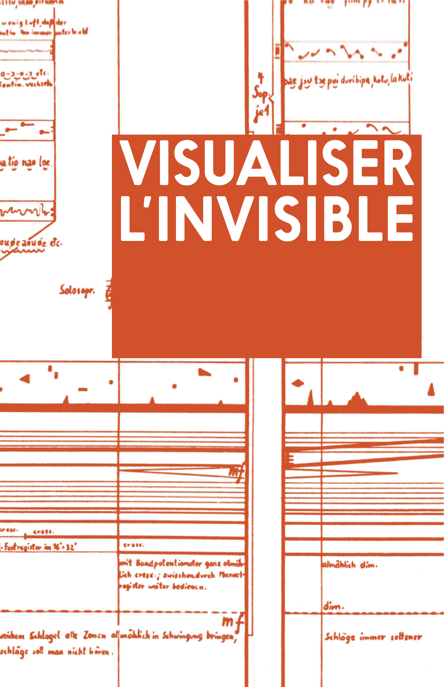

Visualiser l’invisible
===

Version 2013.

## À propos

Un court livre se demandant pourquoi et comment représenter les phénomènes non-visibles. Un texte garanti avec fautes, inexactitudes et omissions.

* [Emplacement original](http://probablement.net/invisible)
* [**Lire dans sa mise en page originale**](http://probablement.net/invisible/pdf/visualiser_l'invisible_ebook_1.1_doubles.pdf) (PDF, doubles pages, 13.4 Mo)

## Colophon

*« Visualiser l’invisible »*

Ce texte, écrit originellement en novembre 2013 par Nicolas Maravitti avec un suivi à l’ECV Provence par Lionel Bérenger, Éric Cattelain et Nathalie Bossard, est placé sous une licence [Creative Commons BY–SA](http://creativecommons.org/licenses/by-sa/3.0/deed.fr). 

Les images appartiennent à leurs auteurs respectifs : consulter les crédits en annexe.

ISBN : 978-2-954 7163-1-2